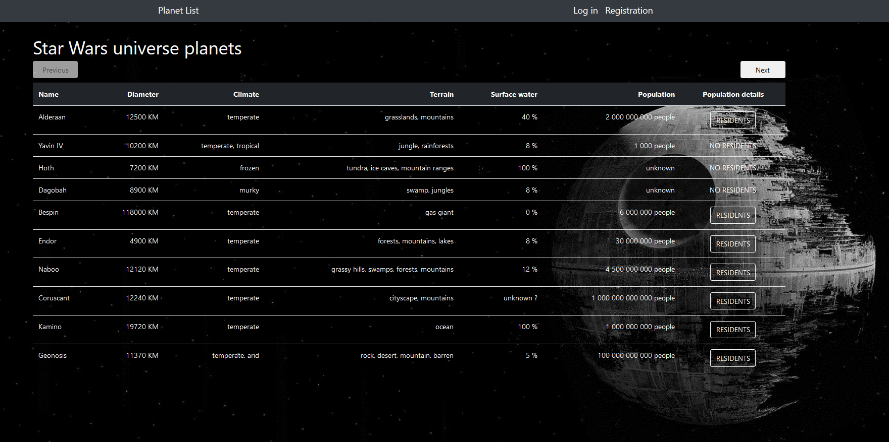
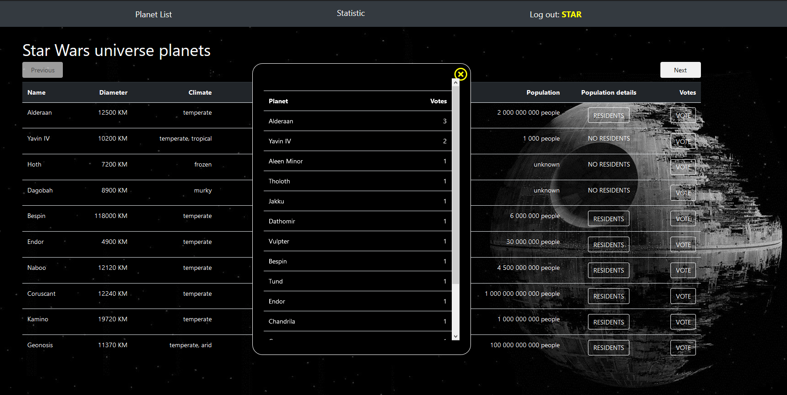

# Project Name
> # API WARS!

## Table of contents
* [General info](#general-info)
* [Features](#features)
* [Technologies](#technologies)
* [Setup](#setup)
* [Screenshots](#screenshots)
* [Status](#status)
* [Inspiration](#inspiration)
* [Contact](#contact)

## General info
This is a web application that shows data about the Star Wars universe. This is the project created during my education in Codecool.

## Features
List of features ready:
* store data (Login and voting informations) in a local database (PostgreSQL)
* fetch information about Star Wars from https://swapi.co API (This site provides an endpoint with no authentication needed)
* create a simple user login system with sessions
* create a voting system (User can vote for planets)

## Technologies
* JavaScript
* Flask (micro web framework for Python)
* HTML, CSS
* AJAX
* Bootstrap
* SQL , Psycopg (the most popular PostgreSQL database adapter for the Python)

## Setup
Direct link: <https://starwars-swapi.herokuapp.com/>

## Screenshots

## Status
Project is: _finished_

## Inspiration
Project inspired by Star Wars

## Contact
Created by [Kamil Woś](mailto:inz.kamil.wos@gmail.com) - feel free to contact me!
